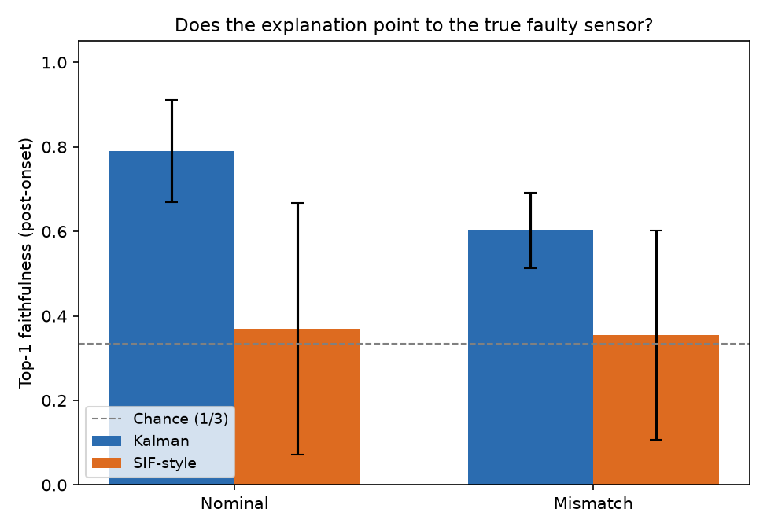

# Faithful explanations for estimation-based fault detection under modeling error

*A small, reproducible research prototype.*

[](https://colab.research.google.com/github/NiliRahmani/estimation-fault-xai/blob/main/notebooks/run_in_colab.ipynb)

Residual-based fault detection is standard in condition monitoring: a state
estimator predicts what its sensors should read, and a fault is flagged when the
normalized innovation squared (NIS) exceeds a chi-square threshold. It is tempting
to also *explain* a detection by attributing it to the measurement channel with
the largest normalized residual. This prototype asks whether that explanation is
**faithful** — whether it points to the sensor that actually failed — and how
faithfulness depends on (a) modeling error and (b) the choice of estimator.

**TL;DR.** With a correct model, residual attribution identifies the true faulty
sensor 79% of the time (chance = 33%); under modeling error this falls to 60% and
the false-alarm rate rises from 0.8% to 68%. A simplified, *SIF-style* robust
estimator halves the false-alarm rate under mismatch (35%), but its residual
explanations collapse to near chance (~0.37) in *both* conditions — the robust
gain absorbs the fault and erases the residual signature. **Robustness and
residual-based explainability are in tension.**

## Research question

> When a fault is detected from filter residuals, does the residual-based
> explanation point to the true fault source — and how does this depend on
> modeling error and on the choice of estimator (Kalman vs a robust SIF-style filter)?

## Hypotheses

- **H1.** As model mismatch grows, model error leaks across channels and
  contaminates the residuals, so top-1 attribution faithfulness falls toward chance.
- **H2.** A robust SIF-style estimator, being less sensitive to the wrong model,
  preserves faithfulness better than the Kalman filter under mismatch.

*Outcome: H1 is supported; H2 is refuted — the robust estimator is better for
detection but worse for residual-based explanation (see Interpretation).*

## Method

| Component     | Choice |
|---------------|--------|
| System        | Linear mass–spring–damper, state = [position, velocity] |
| Measurements  | 3 channels: position, velocity, position+velocity |
| Estimators    | Kalman filter; simplified SIF-style robust estimator (see note) |
| Fault         | Constant sensor bias (6σ) on one randomly chosen channel, onset at t = 50% |
| Detection     | NIS vs. χ²(df=3) threshold at α = 0.99 (same for both estimators) |
| Attribution   | Per-channel normalized squared residual, νᵢ²/Sᵢᵢ; top-1 channel = explanation |
| Conditions    | Nominal (correct model) vs. Mismatch (filter stiffness ×1.7) |
| Repeats       | 20 random seeds per condition (both estimators see identical data) |

The faithfulness ground truth is well-defined because the fault is injected: we
know which channel failed and when, so "did the explanation point to that channel
after onset?" is directly scorable (top-1 faithfulness).

> **On the SIF-style estimator.** This is a *simplified, SIF-style* robust
> estimator built for comparison — **not a reproduction of Professor Gadsden's
> SIF/SVSF work**. It keeps the defining idea (a corrective gain that reacts
> directly to the innovation through a saturated sliding boundary layer,
> `K = C⁺·sat(|ν|/δ)`, instead of the model-derived Kalman gain) but omits the
> full SVSF/SIF formulations (e.g. optimal/variable boundary layers, secondary
> performance indicators). A covariance is propagated only so the same NIS
> detector and attribution apply to both estimators.

## Baselines

- **Random attribution** — pick a channel uniformly at random; expected top-1
  faithfulness = 1/3 (the chance line in the figure). Any useful explanation must
  beat this.
- **Kalman filter with the correct model** — the optimal estimator and the
  reference point for "how faithful can residual attribution be when nothing is
  wrong."
- **Detection-only view** — detection rate and latency, included to show that
  detection alone looks perfect (rate 1.0, latency 0) and therefore hides the
  differences that only appear in false-alarm rate and faithfulness.

## Results

Mean over 20 seeds per condition (see `results/summary_table.csv`):

| Estimator | Condition | Detection rate | False-alarm rate | Latency (steps) | State RMSE | Faithfulness (model) | Faithfulness (random) |
|-----------|-----------|:--:|:--:|:--:|:--:|:--:|:--:|
| Kalman    | Nominal   | 1.00 | 0.008 | 0 | 0.118 | **0.79 ± 0.12** | 0.33 |
| Kalman    | Mismatch  | 1.00 | 0.677 | 0 | 0.158 | **0.60 ± 0.09** | 0.33 |
| SIF-style | Nominal   | 1.00 | 0.009 | 0 | 0.171 | **0.37 ± 0.30** | 0.33 |
| SIF-style | Mismatch  | 1.00 | 0.353 | 0 | 0.180 | **0.35 ± 0.25** | 0.33 |



## Interpretation

The 6σ fault is always detected (rate 1.0, latency 0) for both estimators in both
conditions, so **detection alone hides every interesting difference** — the story
is in the false-alarm rate and the explanation faithfulness.

- **Kalman + correct model:** residual attribution is genuinely informative
  (0.79, well above the 0.33 chance line).
- **Kalman + mismatch (H1 supported):** model error contaminates the residuals —
  faithfulness loses ~40% of its above-chance margin (0.79 → 0.60) and the
  false-alarm rate explodes (0.8% → 68%). The explanation is least trustworthy
  exactly when the model is wrong.
- **SIF-style (H2 refuted):** the robust estimator is **better for detection** —
  under mismatch its false-alarm rate is roughly half the Kalman's (35% vs 68%) —
  but its residual-based explanations are **near chance in both conditions
  (~0.37)**. The innovation-driven robust gain corrects aggressively and absorbs
  the sensor bias into the state estimate, which erases the per-channel residual
  signature that attribution depends on. This holds across a wide range of the
  boundary-layer width δ, so it is structural, not a tuning artifact.

**Takeaway.** Robustness and *residual-based* explainability are in tension. A more
robust estimator does not automatically give more trustworthy explanations; for
the SIF-style filter, naive residual attribution fails outright. This motivates
estimator-native fault indicators rather than off-the-shelf residual attribution.

## Limitations

- Simulation only; faithfulness ground truth exists because faults are injected.
- One linear system, one fault type (sensor bias), one fault active at a time.
- The SIF-style estimator is simplified (see note above), not the full SIF/SVSF.
- Single residual attribution method; no learned detector or post-hoc method yet.
- Mismatch is a single stiffness perturbation, not a sweep.

## Why this matters for Professor Gadsden's work

The prototype sits at the intersection of two themes central to the ICE Lab:
**reliable / explainable AI** (can we trust an automatically generated
explanation?) and **estimation-based condition monitoring and virtual sensors**
(how do residual methods behave under model error?). The result is a concrete,
quantified instance of a reliability question that is easy to overlook: an
explanation can look confident and still be wrong, and the more robust estimator
is precisely the one for which naive residual attribution fails. That tension is
directly relevant to building fault-detection and virtual-sensor systems whose
*explanations* — not just their detections — can be trusted.

## How this could be extended

- **Toward full SIF/SVSF.** Replace the simplified estimator with the full
  SIF / SVSF (including the variable boundary layer and secondary performance
  indicators) and test whether estimator-native fault indicators are more
  faithful than residual attribution — the question this prototype raises.
- **Toward real data.** Swap the simulator for real condition-monitoring or
  robotic-arm telemetry (e.g. drive-current / joint signals), where faults are
  degradation, drift, or actuator faults rather than a clean injected bias.
- **Broader sweep.** Vary mismatch level and fault type (drift, stuck sensor,
  actuator fault) and report faithfulness as a function of mismatch; add
  faithfulness measures beyond top-1 (attribution mass, deletion fidelity,
  temporal alignment); compare against a post-hoc method on a learned detector.

## Reproduce

Locally:

```bash
pip install -r requirements.txt
python reproduce.py            # writes results/ (raw CSV, summary CSV, figure)
pytest -q                      # sanity checks on the estimators
```

Or run it in the browser with no setup via the **Open in Colab** badge above
(`notebooks/run_in_colab.ipynb`).

Everything is seeded; re-running reproduces the tables and figure exactly. All
parameters live in `config.yaml`.

## Repository layout

```
config.yaml          all experiment parameters (seeds, system, fault, mismatch)
reproduce.py         one-command entry point
src/system.py        plant + 3-channel measurement model, nominal & mismatched
src/faults.py        sensor-bias injection
src/estimators.py    Kalman filter + simplified SIF-style estimator (return innovations)
src/detection.py     NIS threshold detector
src/attribution.py   model-based and random attribution
src/metrics.py       detection rate, false-alarm rate, latency, RMSE, faithfulness
src/experiment.py    run one trial; sweep conditions × seeds
src/plotting.py      the single figure
tests/test_sanity.py estimator sanity checks
notebooks/run_in_colab.ipynb   one-click browser reproduction (Colab)
```
